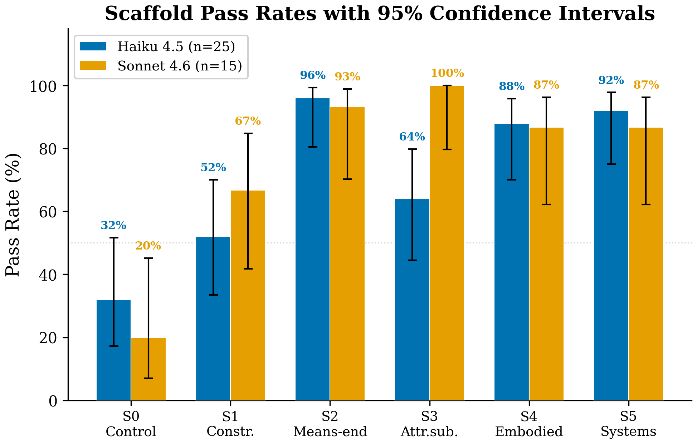
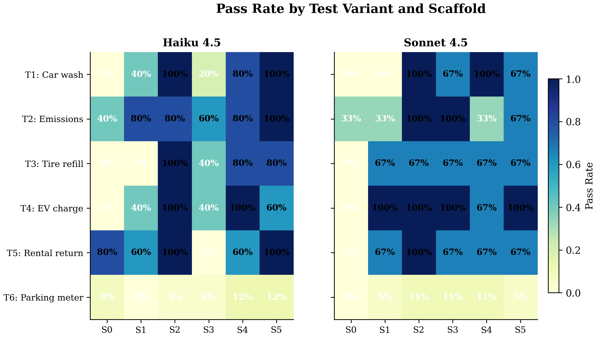
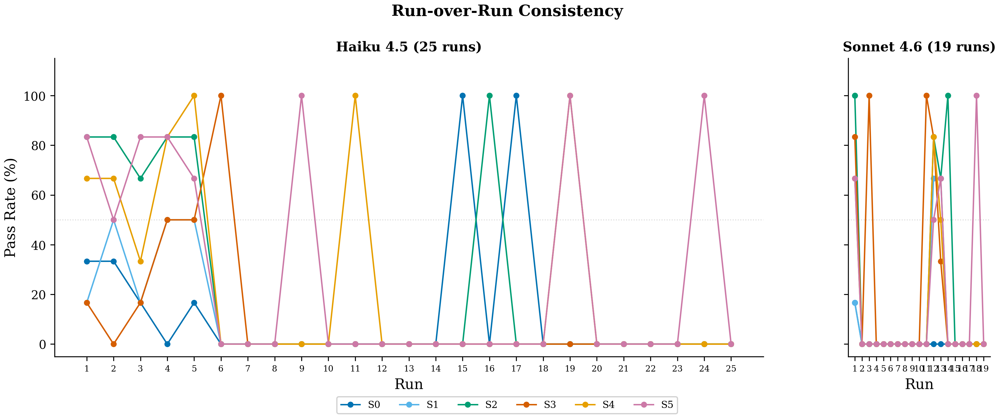

# Constraint Coherence Benchmark

[](LICENSE)
[](https://python.org)
[](runs/scored_combined_all_models.json)
[](#what-we-found)

Ask an LLM whether you should walk or drive to the car wash — it's only 100 meters away. Most models say walk. They forget the car needs to be there too.

This is a specific, reproducible instance of a broader failure: LLMs substitute **proxy metrics** (distance, convenience, fuel cost) for the **actual goal** (getting the car washed), silently dropping an unstated physical constraint. The car must be at the car wash. You have to drive.

We built a benchmark around this failure and tested whether structured reasoning prompts can fix it.

## What we found

Six reasoning scaffolds, five test scenarios, two Claude models, 240 scored responses.



**One scaffold dominates.** Means-end analysis — forcing the model to define the goal state and work backward to its preconditions — achieves **96% on Haiku** and **93% on Sonnet**. The unscaffolded control sits at 24% and 7%. That's an odds ratio of 76–196 (Fisher's exact, p < 0.001).

**Not all scaffolds help.** Telling the model to check whether it's optimizing a proxy metric (S3) actually fails to improve performance on Haiku (32% vs 24% control, p = 0.754). Asking a model to watch out for exactly the mistake it's making doesn't work — it may even reinforce the error.

**The mechanism is backward chaining.** The model fails because it reasons forward: short distance → walking is practical → walk. Means-end analysis forces it to reason backward: goal is car-at-wash → car must be driven there → drive. This independently converges with Jo (2026), who found that STAR's Task step — a different formalism for the same backward-chaining mechanism — achieves 85% on Sonnet.

| Scaffold | Haiku 4.5 (n=25) | Sonnet 4.5 (n=15) |
|----------|:-:|:-:|
| S0 — Control | 24% | 7% |
| S1 — Constraints-first | 44% | 53% |
| **S2 — Means-end analysis** | **96%** | **93%** |
| S3 — Attribute substitution | 32% | 80% |
| S4 — Embodied simulation | 80% | 67% |
| S5 — Systems causal map | 88% | 73% |

### What the heatmap reveals



S2 achieves near-ceiling performance across all five test variants. S3's dramatic model split (32% Haiku vs 80% Sonnet) suggests metacognitive scaffolds interact differently with model capacity. S4 and S5 are effective but show more variance.

### Stability across runs



## The five test scenarios

Each scenario requires a vehicle to be physically present at a destination. The constraint is never stated — the model must infer it.

| ID | Scenario | Distance | Why models fail |
|----|----------|:--------:|-----------------|
| T1 | Car wash | 100m | Classic: distance heuristic overwhelms goal analysis |
| T2 | Drive-through emissions test | 180m | "Drive-through" in the name, yet models still say walk |
| T3 | Tire air pump | 120m | Car needs to be at the pump — not just you |
| T4 | EV charging bay | 140m | Must plug the car in, can't carry it |
| T5 | Rental car return lane | 250m | Must return the car, not yourself |

## The six scaffolds

| ID | Strategy | What it does |
|----|----------|-------------|
| S0 | Control | Bare prompt, no scaffolding |
| S1 | Constraints-first | "List all hard constraints before deciding" |
| S2 | Means-end analysis | "Define the goal state. Work backward to preconditions." |
| S3 | Attribute substitution | "Check: are you optimizing a proxy metric?" |
| S4 | Embodied simulation | "Mentally simulate each option step by step" |
| S5 | Systems causal map | "Map entities, relationships, and causal chains" |

## Run it yourself

```bash
pip install -r requirements.txt

# Run the benchmark with any OpenRouter model
OPENROUTER_API_KEY=sk-... python3 run_benchmark.py --model meta-llama/llama-3.3-70b-instruct:free

# Score results
python3 score_results.py

# Reproduce stats + charts
python3 stats_analysis.py
python3 generate_charts.py
```

## Scoring

Each response is scored on whether the model:
1. **Detected** the implicit constraint (car must be at destination)
2. **Rejected** the infeasible option (walking)
3. **Recommended** the correct action (driving)

**Strict pass** = all three. Automated scoring validated against manual annotation (n=30, Cohen's κ = 0.786).

## Repository structure

```
data/           Tests and scaffold prompts
runs/           240 scored responses (JSON)
analysis/       Pass rates, CIs, Fisher test results
validation/     Manual annotation sample + agreement stats
paper/          Figures (PNG) and LaTeX tables
```

## Citation

```bibtex
@misc{constraintcoherence2026,
  title={Constraint Coherence Benchmark: Recovering Implicit Physical Reasoning in LLMs via Cognitive Scaffolds},
  year={2026},
  note={https://github.com/tns-research/constraint-coherence}
}
```

## License

MIT
