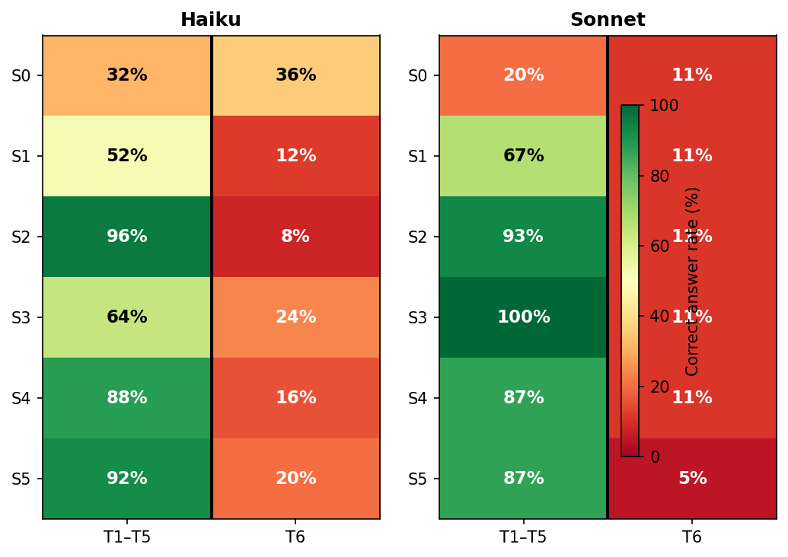
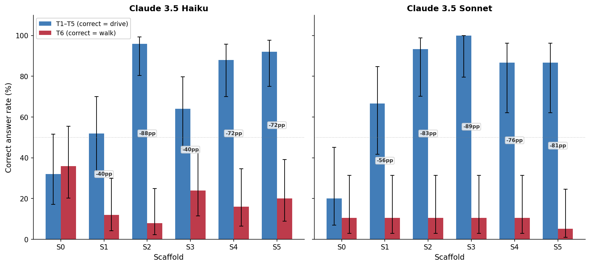
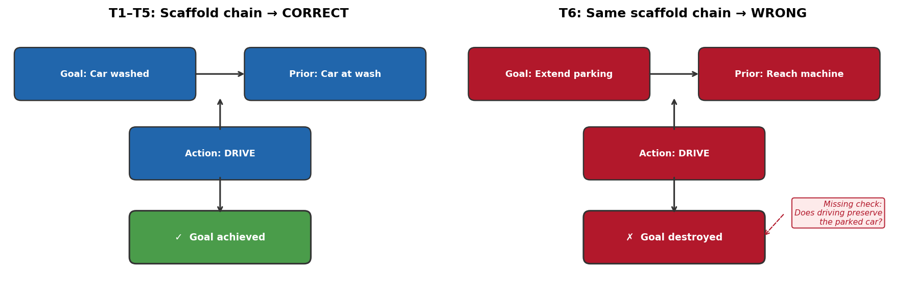
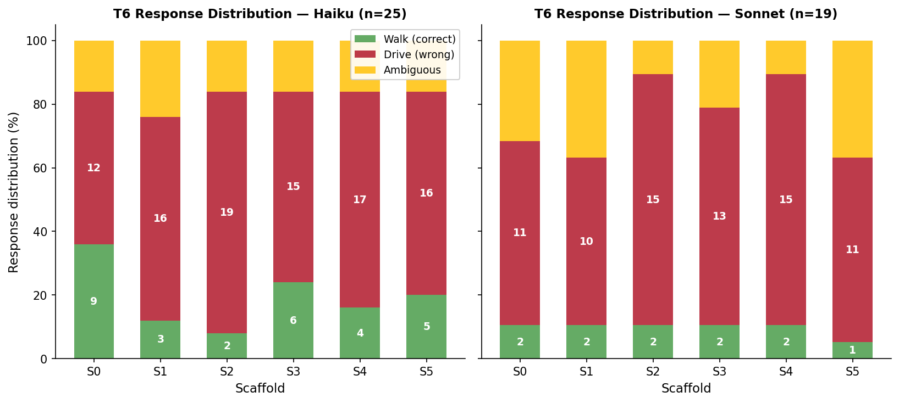
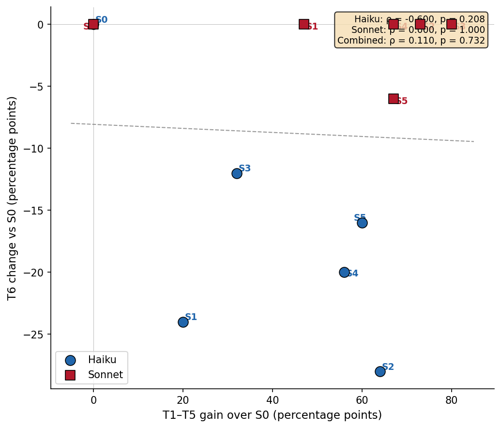

# Constraint Coherence Benchmark

[](LICENSE)
[](https://python.org)
[](runs/scored_combined_all_models.json)
[](#when-scaffolds-backfire-t6)

Ask an LLM whether you should walk or drive to the car wash — it's only 100 meters away. Most models say walk. They forget the car needs to be there too.

This is a specific, reproducible instance of a broader failure: LLMs substitute **proxy metrics** (distance, convenience, fuel cost) for the **actual goal** (getting the car washed), silently dropping an unstated physical constraint. The car must be at the car wash. You have to drive.

We built a benchmark around this failure and tested whether structured reasoning prompts can fix it.

They do, dramatically, on forward-constraint problems. But when we invert the constraint structure, the same scaffolds backfire: they make the model more confidently wrong.

## What we found

Six reasoning scaffolds, six test scenarios (five forward + one inverse), two Claude models, 504 scored responses across T1-T6.



**One scaffold dominates.** Means-end analysis — forcing the model to define the goal state and work backward to its preconditions — achieves **96% on Haiku** and **93% on Sonnet**. The unscaffolded control sits at 32% and 20%.

**All scaffolds improve T1-T5 performance.** Every scaffold pushes both models above their baselines. S3 (attribute substitution) reaches 100% on Sonnet; S2 (means-end analysis) reaches 96% on Haiku.

**The mechanism is backward chaining.** The model fails because it reasons forward: short distance → walking is practical → walk. Means-end analysis forces it to reason backward: goal is car-at-wash → car must be driven there → drive.

| Scaffold | Haiku 4.5 (n=25) | Sonnet 4.6 (n=15) |
|----------|:-:|:-:|
| S0 - Control | 32% | 20% |
| S1 - Constraints-first | 52% | 67% |
| **S2 - Means-end analysis** | **96%** | **93%** |
| S3 - Attribute substitution | 64% | 100% |
| S4 - Embodied simulation | 88% | 87% |
| S5 - Systems causal map | 92% | 87% |

## When scaffolds backfire: T6

T6 inverts the constraint. Your parking meter expires in 3 minutes. The meter machine is 400 meters away. Should you walk or drive? Driving vacates your parking spot, so the correct answer is **walk**.

On T1-T5, scaffolds push Haiku from 32% to 96%. On T6, they push it from 36% **down to 8%**.



The best T1-T5 scaffold (S2, means-end analysis) becomes the worst on T6. It forces backward chaining from the goal, but never questions whether the sub-goals preserve the goal's preconditions. We call this a **reasoning tunnel**.



| Scaffold | Haiku T6 Walk% (n=25) | Sonnet T6 Walk% (n=19) |
|----------|:-:|:-:|
| **S0 - Control** | **36%** | 11% |
| S1 - Constraints-first | 12% | 11% |
| S2 - Means-end analysis | 8% | 11% |
| S3 - Attribute substitution | 24% | 11% |
| S4 - Embodied simulation | 16% | 11% |
| S5 - Systems causal map | 20% | 5% |

Scaffolds don't just fail to help on T6. They convert uncertainty into confident error:



Under S0, Haiku produces 9 walk, 12 drive, and 4 ambiguous responses. Under S2, it shifts to 2 walk, 19 drive, 4 ambiguous. The scaffold eliminates hedging and locks in the wrong answer.



## The six test scenarios

Tests T1-T5 require the vehicle to be physically present at a destination (correct answer: **drive**). T6 inverts the constraint: the vehicle must *stay* at its current location (correct answer: **walk**). In every case the constraint is never stated — the model must infer it.

| ID | Scenario | Distance | Correct | Why models fail |
|----|----------|:--------:|:-------:|-----------------|
| T1 | Car wash | 100m | drive | Classic: distance heuristic overwhelms goal analysis |
| T2 | Drive-through emissions test | 180m | drive | "Drive-through" in the name, yet models still say walk |
| T3 | Tire air pump | 120m | drive | Car needs to be at the pump — not just you |
| T4 | EV charging bay | 140m | drive | Must plug the car in, can't carry it |
| T5 | Rental car return lane | 250m | drive | Must return the car, not yourself |
| **T6** | **Parking meter (inverse)** | **400m** | **walk** | Driving vacates the parking spot, defeating the goal |

### T6 — The inverse test

T6 tests whether models truly reason about constraints or merely memorize the T1-T5 pattern. Your parking meter expires in 3 minutes and the meter machine is 400 meters away. Most models say drive — it's faster. But driving means leaving the parking spot, making the paid extension worthless. The correct answer is **walk**: you arrive late but the car keeps its spot.

This is the mirror image of T1-T5. Where T1-T5 test for *object-must-reach-destination*, T6 tests for *object-must-stay-at-origin*. Scaffolds effective on T1-T5 systematically fail on T6: models that learned "the car must be there" don't generalize to "the car must stay here." Detailed T6 statistics are in `analysis/scaffold_stats_t6.csv` and `analysis/fisher_test_results_t6.json`.

## The six scaffolds

| ID | Strategy | What it does |
|----|----------|-------------|
| S0 | Control | Bare prompt, no scaffolding |
| S1 | Constraints-first | "List all hard constraints before deciding" |
| S2 | Means-end analysis | "Define the goal state. Work backward to preconditions." |
| S3 | Attribute substitution | "Check: are you optimizing a proxy metric?" |
| S4 | Embodied simulation | "Mentally simulate each option step by step" |
| S5 | Systems causal map | "Map entities, relationships, and causal chains" |

## Run it yourself

```bash
pip install -r requirements.txt

# Run the benchmark with any OpenRouter model
OPENROUTER_API_KEY=sk-... python3 run_benchmark.py --model meta-llama/llama-3.3-70b-instruct:free

# Run only specific tests (e.g. the inverse test)
OPENROUTER_API_KEY=sk-... python3 run_benchmark.py --model meta-llama/llama-3.3-70b-instruct:free --tests T6

# Score results (bidirectional: auto-detects correct answer per test)
python3 score_results.py

# Reproduce stats + charts
python3 stats_analysis.py
python3 generate_charts.py
```

## Scoring

Each response is scored on whether the model:
1. **Detected** the implicit constraint (car must be at destination for T1-T5; car must stay at origin for T6)
2. **Rejected** the infeasible option (walking for T1-T5; driving for T6)
3. **Recommended** the correct action (driving for T1-T5; walking for T6)

**Strict pass** = all three. Scoring is bidirectional: `correct_answer` is read from `data/tests.json` per test, so the scorer handles both constraint directions automatically. Automated scoring validated against manual annotation (T1-T5: Cohen's kappa = 0.786, n=30; T6: kappa = 0.639, n=70).

## Repository structure

```
data/           Tests (6 scenarios) and scaffold prompts
runs/           504 scored responses (JSON) for T1-T6
analysis/       Pass rates, CIs, Fisher test results (T1-T5 and T6)
validation/     Manual annotation sample + agreement stats
figures/        Publication figures (PNG)
```

## Citation

```bibtex
@misc{constraintcoherence2026,
  title={When Reasoning Scaffolds Backfire: Structured Prompting Creates Systematic Failure Under Constraint Inversion},
  year={2026},
  note={https://github.com/tns-research/constraint-coherence}
}
```

## License

MIT
